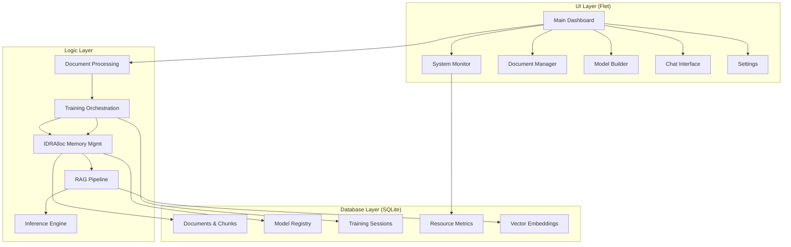

# MikroDok

[](https://www.python.org/downloads/)
[](https://flet.dev/)
[](https://pytorch.org/)
[](LICENSE)
[](https://github.com/etemigarba/MikroDok)
[](https://github.com/etemigarba/MikroDok/actions)

---

**MikroDok "Document Language Model Builder"** — An offline-first desktop application that democratizes Large Language Model development by transforming documents into custom 1–7B parameter models using innovative **Intelligent Dynamic Resource Allocation (IDRAlloc)** memory bridging across GPU VRAM, System RAM, and NVMe storage.

## 🏗️ Architecture Overview



## ✨ Key Features

| Feature | Description |
|---------|-------------|
| **🧠 IDRAlloc Memory Bridging** | Revolutionary three-tier memory management (GPU VRAM → System RAM → NVMe) enabling 7B models on consumer hardware |
| **📄 Multi-Format Document Processing** | PDF, DOCX, TXT, HTML, Markdown with OCR, table extraction, and semantic chunking |
| **🔍 Hybrid RAG Search** | Semantic (ChromaDB) + Keyword (BM25) retrieval with weighted fusion and cross-encoder reranking |
| **⚡ ONNX-Optimized Inference** | Sub-2-second response times for 7B INT4 models via ONNX Runtime with TensorRT |
| **🎯 Three Allocation Modes** | Legacy (GPU-only), Hybrid (CPU+GPU), Auto IDRAlloc (ML-based dynamic selection) |
| **🔒 Complete Offline Operation** | Zero cloud dependency — data sovereignty, GDPR/HIPAA compliant, air-gapped deployment ready |
| **📊 Real-Time Monitoring** | Live GPU/CPU/RAM/NVMe dashboards with thermal throttling protection and predictive optimization |
| **🏷️ Model Versioning** | Git-style checkpoint management with semantic versioning, rollback, and benchmark comparison |
| **♿ WCAG 2.1 AA Accessible** | Full keyboard navigation, screen reader support, high-contrast themes, dyslexia-friendly fonts |

## 🖥️ System Requirements

### Minimum Configuration
- **CPU**: Intel i5-8600K / AMD Ryzen 5 3600 (AVX2 support required)
- **RAM**: 16GB DDR4 3200MHz
- **GPU**: NVIDIA RTX 3070 (8GB VRAM) with CUDA 11.8+
- **Storage**: 1TB NVMe SSD (Gen3 x4, 3500MB/s read)
- **Display**: 1920×1080 resolution
- **OS**: Windows 10 21H2+, macOS 11 Big Sur+, Ubuntu 20.04+

### Recommended Configuration
- **CPU**: Intel i7-12700K / AMD Ryzen 7 5800X
- **RAM**: 64GB DDR4 3600MHz (4×16GB)
- **GPU**: NVIDIA RTX 4090 (24GB VRAM) with CUDA 12.0+
- **Storage**: 2TB NVMe SSD (Gen4 x4, 7000MB/s read)
- **Display**: 2560×1440 resolution

## 🚀 Installation

### Prerequisites
```bash
# Python 3.12+ (embedded in distribution)
# NVIDIA Driver 525.60+ (535.104+ recommended)
# CUDA Toolkit 11.8+ (12.0+ for optimal performance)
```

### Quick Start (Development)
```bash
# Clone repository
git clone https://github.com/etemigarba/MikroDok.git
cd MikroDok

# Create virtual environment
python -m venv .venv
source .venv/bin/activate  # Windows: .venv\Scripts\activate

# Install dependencies
pip install -r requirements.txt
pip install -r requirements-dev.txt

# Run application
python -m src.main
```

### Production Installation
Download the latest signed installer from [Releases](https://github.com/etemigarba/MikroDok/releases):
- **Windows**: `MikroDok-Setup-x64.msi` (silent install: `/quiet /norestart`)
- **macOS**: `MikroDok-x64.dmg` (notarized, signed)
- **Linux**: `MikroDok-x86_64.AppImage` (universal)

## 📖 Usage Workflow


### 1. Document Ingestion
- Drag & drop or batch import PDF, DOCX, TXT, HTML, Markdown files (up to 10GB)
- Automatic format detection, OCR, table extraction, and metadata preservation
- Real-time quality scoring and deduplication

### 2. Model Configuration
- Select architecture: 1B, 3B, or 7B parameters
- Choose training method: From Scratch / Fine-Tune / QLoRA
- Configure hyperparameters (batch size, learning rate, epochs)

### 3. Resource Allocation (IDRAlloc)
| Mode | Best For | Memory Strategy |
|------|----------|-----------------|
| **Legacy** | Models ≤ GPU VRAM | GPU-only, maximum speed |
| **Hybrid** | Models 1-3× VRAM | CPU+GPU with layer bridging |
| **Auto IDRAlloc** | Any size / Unknown hardware | ML-predicted optimal distribution |

### 4. Training & Monitoring
- Real-time loss curves, validation metrics, resource utilization
- Automatic checkpointing every epoch with resume capability
- Thermal throttling protection and memory pressure prediction

### 5. Deployment & Chat
- One-click ONNX conversion with INT4/INT8/FP16 quantization
- Cross-platform inference engine (CUDA / CPU / Metal)
- Interactive chat with RAG-enhanced responses and source citations

## ⚙️ Configuration

### Resource Allocation Profiles
```json
{
  "allocation_mode": "Auto",
  "gpu_memory_limit_mb": 20480,
  "cpu_memory_limit_mb": 32768,
  "nvme_swap_path": "/fast_nvme/swap",
  "nvme_swap_size_gb": 100,
  "priority": "high",
  "thermal_limit_celsius": 83
}
```

### Application Settings (via UI or `config.json`)
- **General**: Language, theme (Light/Dark/Auto), auto-save, update channel
- **Resources**: GPU selection, memory limits, NVMe path, performance profile
- **Models**: Default architecture, training defaults, quantization presets
- **Processing**: Format support, chunk size (256-2048), OCR languages, deduplication
- **Advanced**: Logging level, telemetry (opt-in), cache management, config export/import

## 🧪 Development Setup

```bash
# Install development dependencies
pip install -e ".[dev]"

# Run tests
pytest tests/ -v --cov=src --cov-report=html

# Run specific test suites
pytest tests/ui/ -v                    # UI responsiveness tests
pytest tests/navigation_ui/ -v         # Navigation tests
pytest tests/ -k "not slow" -v         # Exclude slow integration tests

# Code quality
ruff check src/ tests/
ruff format src/ tests/
mypy src/

# Pre-commit hooks
pre-commit install
pre-commit run --all-files
```

### Project Structure
```
MikroDok/
├── src/
│   ├── main.py                          # Application entry point
│   ├── modules/
│   │   ├── core/                        # Core infrastructure
│   │   ├── logic/                       # Business logic (LLM-free)
│   │   │   ├── application_lifecycle_lg/
│   │   │   ├── document_ingestion_lg/
│   │   │   ├── document_extraction_lg/
│   │   │   ├── document_chunking_lg/
│   │   │   ├── document_quality_lg/
│   │   │   ├── training_orchestration_lg/
│   │   │   ├── checkpoint_management_lg/
│   │   │   ├── training_metrics_lg/
│   │   │   ├── training_data_pipeline_lg/
│   │   │   ├── model_optimization_lg/
│   │   │   ├── memory_allocation_lg/
│   │   │   ├── memory_bridging_lg/
│   │   │   ├── nvme_virtual_memory_lg/
│   │   │   ├── memory_optimization_lg/
│   │   │   ├── embedding_generation_lg/
│   │   │   ├── vector_search_lg/
│   │   │   ├── hybrid_search_lg/
│   │   │   ├── query_processor_lg/
│   │   │   ├── context_builder_lg/
│   │   │   ├── rag_orchestrator_lg/
│   │   │   ├── resource_monitor_lg/
│   │   │   ├── performance_optimizer_lg/
│   │   │   ├── resource_predictor_lg/
│   │   │   └── monitoring_aggregator_lg/
│   │   ├── ui/                          # Flet UI components
│   │   │   ├── main_dashboard_ui/
│   │   │   ├── navigation_ui/
│   │   │   ├── system_monitor_ui/
│   │   │   ├── document_manager_ui/
│   │   │   ├── search_interface_ui/
│   │   │   ├── chat_interface_ui/
│   │   │   ├── model_builder_ui/
│   │   │   ├── model_registry_ui/
│   │   │   ├── settings_panel_ui/
│   │   │   ├── training_monitor_ui/
│   │   │   ├── checkpoint_viewer_ui/
│   │   │   ├── memory_monitor_ui/
│   │   │   ├── memory_config_ui/
│   │   │   ├── resource_dashboard_ui/
│   │   │   ├── monitoring_controls_ui/
│   │   │   ├── optimization_status_ui/
│   │   │   ├── dialog_components_ui/
│   │   │   ├── visualization_ui/
│   │   │   └── splash_screen_ui/
│   │   └── database/                    # SQLite data access
│   │       ├── app_state_db/
│   │       ├── system_config_db/
│   │       ├── documents_db/
│   │       ├── document_collections_db/
│   │       ├── document_queue_db/
│   │       ├── document_quality_db/
│   │       ├── training_sessions_db/
│   │       ├── training_metrics_db/
│   │       ├── checkpoints_db/
│   │       ├── training_config_db/
│   │       ├── vector_storage_db/
│   │       ├── search_index_db/
│   │       ├── search_cache_db/
│   │       ├── rag_metadata_db/
│   │       ├── resource_monitoring_db/
│   │       ├── database_core_db/
│   │       ├── blob_storage_db/
│   │       └── chat_repository_db/
├── project_documents/                   # Design & analysis docs
│   ├── 01_a_analysis_(statement_of_the_problem).md
│   ├── 01_b_analysis_(concept_notes).md
│   ├── 01_c_analysis_(proposal-technical_blueprint).md
│   ├── 01_d_analysis_(requirements).md
│   ├── 02_a_design_(front_end_-_ui-ux).md
│   ├── 02_b_design_(back_end_-_database).md
│   ├── 02_c_design_(logic_-_algorithms+data_structures).md
│   ├── 03_a_development_(modular_structure_for_development).md
│   └── 03_b_development_(order_of_implementation).md
├── tests/                               # Test suites
├── scripts/                             # Build & verification scripts
├── docs/                                # Documentation (to be generated)
├── .github/                             # GitHub workflows & templates
└── pyproject.toml                       # Project configuration
```

## 📦 Dependencies

### Core Runtime
```txt
flet>=0.21.0
torch>=2.1.0
torchvision>=0.16.0
torchaudio>=2.1.0
onnxruntime-gpu>=1.16.0
deepspeed>=0.12.0
transformers>=4.36.0
bitsandbytes>=0.41.0
chromadb>=0.4.0
sentence-transformers>=2.2.0
langchain>=0.1.0
sqlite3 (stdlib)
numpy>=1.26.0
pillow>=10.1.0
```

### Document Processing
```txt
pdfplumber>=0.10.0
python-docx>=1.1.0
beautifulsoup4>=4.12.0
markdown>=3.5.0
pytesseract>=0.3.10
```

### Development
```txt
pytest>=7.4.0
pytest-asyncio>=0.21.0
pytest-cov>=4.1.0
ruff>=0.1.0
mypy>=1.7.0
pre-commit>=3.6.0
```

## 📚 Documentation

| Document | Description |
|----------|-------------|
| [Architecture](docs/architecture.md) | System architecture, module design, data flows |
| [API Reference](docs/api.md) | Internal APIs, service interfaces, event system |
| [Deployment Guide](docs/deployment.md) | Production deployment, packaging, distribution |
| [Development Guide](docs/development.md) | Contributing, coding standards, testing patterns |
| [IDRAlloc Deep Dive](docs/idralloc.md) | Memory bridging algorithm technical details |
| [RAG Implementation](docs/rag.md) | Retrieval-Augmented Generation pipeline |

## 🤝 Contributing

We welcome contributions! Please read our [Contributing Guide](CONTRIBUTING.md) for details on:
- Code of Conduct
- Development workflow
- Coding standards (Ruff, MyPy, PEP 8)
- Testing requirements
- Pull request process

### Quick Contribution Checklist
- [ ] Fork the repository
- [ ] Create feature branch (`git checkout -b feature/amazing-feature`)
- [ ] Write tests for new functionality
- [ ] Ensure all tests pass (`pytest`)
- [ ] Run linting (`ruff check && ruff format`)
- [ ] Type check (`mypy src/`)
- [ ] Update documentation
- [ ] Submit Pull Request

## 📄 License & Copyright

**Copyright © 2025 Etemi Joshua Garba. All rights reserved.**

This software is **proprietary**. Explicit written permission is required from the copyright holder for:
- Adoption or use in any form
- Editing, modification, or refactoring of the codebase
- Distribution, sublicensing, or derivative works
- Commercial use

See [LICENSE](LICENSE) for full terms.

## 🙏 Acknowledgments

- **Flet** — Cross-platform Python UI framework
- **PyTorch & DeepSpeed** — ML training infrastructure
- **ONNX Runtime** — High-performance inference
- **ChromaDB** — Embedded vector database
- **Hugging Face Transformers** — Model architectures
- **bitsandbytes** — Quantization kernels
- **Sentence Transformers** — Embedding models

---

<div align="center">

**Built with ❤️ for the democratization of AI**

[Report Bug](https://github.com/etemigarba/MikroDok/issues) • [Request Feature](https://github.com/etemigarba/MikroDok/issues) • [Documentation](https://github.com/etemigarba/MikroDok/wiki)

</div>